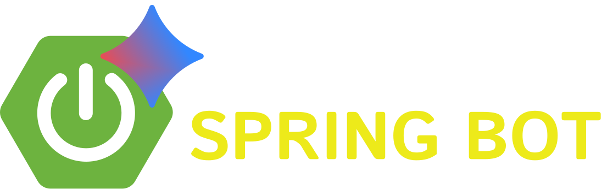

# 🤖 SpringBot

<div align="center">



**A Modern AI-Powered Chatbot**

[](https://www.oracle.com/java/)
[](https://spring.io/projects/spring-boot)
[](https://reactjs.org/)
[](https://vitejs.dev/)
[](https://sass-lang.com/)

*Intelligent conversations powered by modern technology*

</div>

## ✨ Features

### 🎨 **Modern UI/UX**
- **Dark Green Theme**: Sophisticated dark green color palette with glassmorphism effects
- **Responsive Design**: Seamless experience across desktop, tablet, and mobile devices
- **Real-time Chatbot Interface**: Smooth animations and auto-scrolling conversation experience
- **Markdown Support**: Rich text formatting for bot responses including code blocks, lists, and more
- **Custom Typography**: Beautiful Urbanist font family throughout the interface

### 🚀 **Advanced Functionality**
- **Auto-Scroll**: Automatic scrolling to latest messages for optimal UX
- **Loading States**: Professional loading indicators with smooth animations
- **Message History**: Persistent conversation history during session
- **Error Handling**: Graceful error handling with user-friendly messages
- **Clear Chat**: One-click conversation history clearing functionality

### 🛠️ **Technical Excellence**
- **Spring Boot Backend**: Robust Java-based REST API
- **React Frontend**: Modern React 19+ with hooks and functional components
- **SCSS Styling**: Organized and maintainable styling with Sass
- **TypeScript Ready**: Modern development practices
- **Hot Reload**: Development server with instant updates

## 🏗️ Architecture

```
SpringBot/
├── 📁 client/                 # React Frontend Interface
│   ├── 📁 public/            # Static assets & logos
│   ├── 📁 src/               # Source code
│   │   ├── 📁 components/    # Reusable React components
│   │   │   ├── Navbar.jsx    # Navigation component
│   │   │   └── Navbar.scss   # Navigation styles
│   │   ├── App.jsx           # Main chatbot interface
│   │   ├── App.scss          # Global styles
│   │   ├── config.js         # Configuration settings
│   │   └── main.jsx          # Application entry point
│   ├── package.json          # Dependencies & scripts
│   └── vite.config.js        # Vite configuration
│
├── 📁 server/                # Spring Boot Backend
│   ├── 📁 src/main/java/com/cyclone/
│   │   ├── 📁 controller/    # REST API controllers
│   │   │   └── ChatController.java
│   │   └── 📁 start/         # Application entry point
│   │       └── Demo.java     # Spring Boot main class
│   ├── pom.xml               # Maven dependencies
│   └── 📁 target/           # Compiled classes
│
└── README.md                 # This file
```

## 🚀 Quick Start

### Prerequisites

Before you begin, ensure you have the following installed:

- **Java 17+** - [Download here](https://www.oracle.com/java/technologies/downloads/)
- **Node.js 18+** - [Download here](https://nodejs.org/)
- **Bun** (recommended) or npm - [Install Bun](https://bun.sh/)
- **Maven 3.8+** - [Install Maven](https://maven.apache.org/install.html)

### 🖥️ Backend Setup (Spring Boot)

1. **Clone the repository**
   ```bash
   git clone https://github.com/lord-cyclone100/Spring-Bot.git
   cd Spring-Bot
   ```

2. **Navigate to server directory**
   ```bash
   cd server
   ```

3. **Install dependencies & run**
   ```bash
   mvn clean install
   mvn spring-boot:run
   ```

4. **Server will start on** `http://localhost:8080`

### 🎨 Frontend Setup (React + Vite)

1. **Navigate to client directory**
   ```bash
   cd client
   ```

2. **Install dependencies**
   ```bash
   bun install
   # or
   npm install
   ```

3. **Start development server**
   ```bash
   bun run dev
   # or
   npm run dev
   ```

4. **Client will start on** `http://localhost:5173`

### 🌐 Production Build

**Build the frontend for production:**
```bash
cd client
bun run build
# or
npm run build
```

## 🔧 Configuration

### Backend Configuration
- **Application**: Configure in `server/src/main/resources/application.properties`
- **CORS**: Configured to allow frontend connections
- **Port**: Default port is `8080`

### Frontend Configuration
- **Backend URL**: Configure in `client/src/config.js`
- **Development**: Auto-configured for `http://localhost:8080`

## 📱 API Endpoints

### Chatbot API
```http
POST /api/send
Content-Type: application/json

{
  "prompt": "Your message here"
}
```

**Response:**
```json
{
  "response": "Bot response with markdown support"
}
```

## 🎨 Theming & Customization

### Color Palette
```scss
// Primary Colors
$primary-dark: #0c1f1c;      // Ultra dark green
$primary-medium: #134e4a;     // Dark teal
$primary-light: #065f46;      // Forest green
$accent: #34d399;             // Emerald green

// Background Gradients
$bg-gradient: linear-gradient(135deg, #0f172a 0%, #134e4a 50%, #1f2937 100%);
$navbar-gradient: linear-gradient(135deg, #0c1f1c 0%, #0f2027 100%);
```

### Typography
- **Primary Font**: Urbanist (Google Fonts)
- **Code Font**: Monaco, Menlo, Ubuntu Mono
- **Weights**: 100-900 available

## 🛠️ Development

### Available Scripts

**Frontend (client/):**
```bash
bun run dev      # Start development server
bun run build    # Build for production
bun run preview  # Preview production build
bun run lint     # Run ESLint
```

**Backend (server/):**
```bash
mvn spring-boot:run    # Start Spring Boot application
mvn clean install     # Clean & install dependencies
mvn test              # Run tests
```

### Development Features
- **Hot Reload**: Instant updates during development
- **Auto-Scroll**: Messages automatically scroll to bottom
- **Error Boundaries**: Graceful error handling
- **Responsive Design**: Mobile-first approach

## 🧩 Tech Stack

<div align="center">

### Frontend Technologies
| Technology | Description | Documentation |
|------------|-------------|---------------|
|  | Modern UI library with latest features | [React Docs](https://reactjs.org/) |
|  | Ultra-fast build tool and dev server | [Vite Docs](https://vitejs.dev/) |
|  | Advanced CSS preprocessing | [Sass Docs](https://sass-lang.com/) |
|  | Modern JavaScript with latest features | [MDN Docs](https://developer.mozilla.org/) |
|  | Rich text rendering for chatbot messages | [React Markdown](https://github.com/remarkjs/react-markdown) |

### Backend Technologies
| Technology | Description | Documentation |
|------------|-------------|---------------|
|  | Modern Java with latest features | [Java Docs](https://docs.oracle.com/en/java/) |
|  | Enterprise-grade framework | [Spring Docs](https://spring.io/projects/spring-boot) |
|  | Dependency management and build tool | [Maven Docs](https://maven.apache.org/) |
|  | RESTful API development | [Spring Web Docs](https://docs.spring.io/spring-framework/docs/current/reference/html/web.html) |

### AI & External APIs
| Technology | Description | Documentation |
|------------|-------------|---------------|
|  | Advanced AI language model for intelligent responses | [Gemini API Docs](https://ai.google.dev/docs) |

### Development Tools & Runtime
| Technology | Description | Documentation |
|------------|-------------|---------------|
|  | Ultra-fast JavaScript runtime & package manager | [Bun Docs](https://bun.sh/) |
|  | JavaScript runtime environment | [Node.js Docs](https://nodejs.org/) |
|  | Code quality and consistency | [ESLint Docs](https://eslint.org/) |
|  | Version control system | [Git Docs](https://git-scm.com/) |
|  | Recommended IDE | [VS Code Docs](https://code.visualstudio.com/) |

### Key Libraries & Dependencies
| Library | Purpose | Badge |
|---------|---------|-------|
| Axios | HTTP client for API communication |  |
| React Hooks | State management and lifecycle |  |
| Google Fonts | Urbanist typography |  |
| CSS3 Animations | Smooth transitions and effects |  |

</div>

## 🤝 Contributing

We welcome contributions! Here's how you can help:

### Getting Started
1. **Fork the repository**
2. **Create a feature branch**: `git checkout -b feature/amazing-feature`
3. **Make your changes** with proper commit messages
4. **Test thoroughly** - both frontend and backend
5. **Submit a pull request**

### Contribution Guidelines
- Follow existing code style and patterns
- Add appropriate comments and documentation
- Test your changes across different screen sizes
- Update README if you add new features
- Ensure both frontend and backend work together

### Areas for Contribution
- 🎨 UI/UX improvements and new themes
- 🚀 Performance optimizations
- 🧪 Additional testing coverage
- 📱 Mobile experience enhancements
- 🔧 New features and integrations
- 📚 Documentation improvements

## 📝 License

This project is licensed under the MIT License - see the [LICENSE](LICENSE) file for details.

## 👥 Authors

- **[@lord-cyclone100](https://github.com/lord-cyclone100)** - *Initial work & Frontend Development*

## 🙏 Acknowledgments

- **Spring Boot Team** - For the amazing backend framework
- **React Team** - For the powerful frontend library
- **Vite Team** - For the lightning-fast build tool
- **Open Source Community** - For continuous inspiration

## 📞 Support

Having issues? We're here to help!

- 🐛 **Bug Reports**: [Open an issue](https://github.com/lord-cyclone100/Spring-Bot/issues)
- 💡 **Feature Requests**: [Request a feature](https://github.com/lord-cyclone100/Spring-Bot/issues)
- 📖 **Documentation**: Check this README and code comments
- 💬 **Discussions**: [Start a discussion](https://github.com/lord-cyclone100/Spring-Bot/discussions)

---

<div align="center">

**Made with ❤️ and ☕ by [@lord-cyclone100](https://github.com/lord-cyclone100)**

⭐ **Star this repo if you found it helpful!** ⭐

</div>